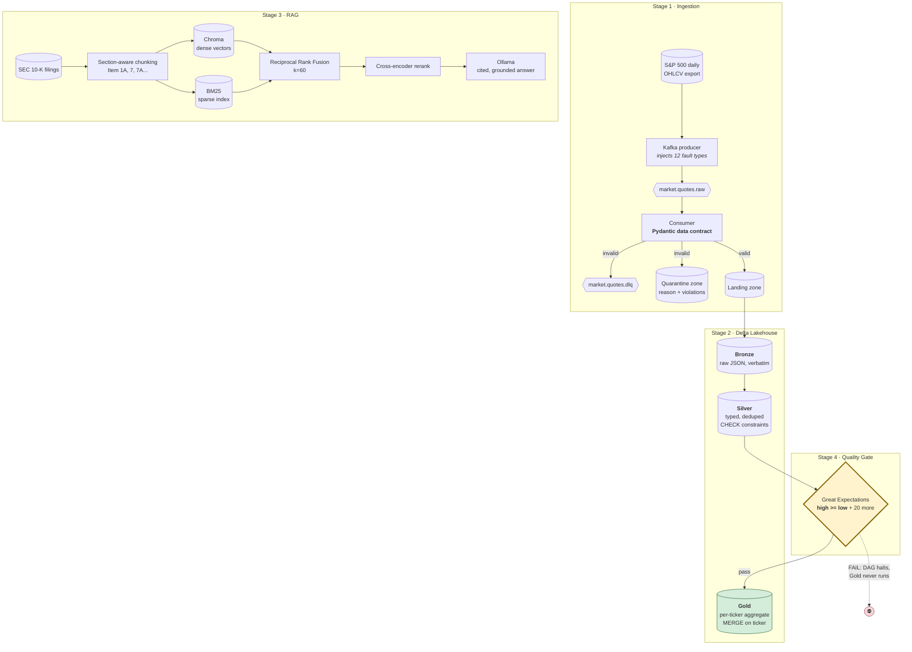

# Financial Market Intelligence System

An end-to-end data platform that turns two kinds of financial data into one queryable
system: a **stream of daily market quotes** flowing through Kafka into a Delta Lake
medallion architecture, and a **corpus of SEC Form 10-K annual reports** served through a
hybrid-retrieval RAG pipeline. Apache Airflow orchestrates both, and a Great Expectations
quality gate stands between the cleaned data and the analytical aggregate — if the data is
wrong, the pipeline stops rather than publishing it.

Built for the **SDAIA Academy** capstone *Modern Data Engineering for AI Systems*.

---

## The problem this solves

An investment analyst asking "is NVDA extended relative to its trend, and what supply-chain
risk does its own 10-K disclose?" is asking two questions that normally live in two
unrelated systems. The quantitative half needs a governed time-series warehouse; the
qualitative half needs semantic search over hundreds of pages of dense legal prose. Neither
is useful if the underlying data is silently wrong.

This project builds both halves on shared infrastructure and shared guarantees:

- **Nothing unvalidated gets in.** A Pydantic data contract runs at the Kafka consumer, and
  every rejected record is preserved with the reason it was rejected.
- **Nothing unverified gets published.** A quality gate sits on the only path into the Gold
  aggregate, and a failed check halts the DAG.
- **Nothing is asserted without a source.** Every RAG answer cites the filing, fiscal year
  and Item number each claim came from, and answers that cite nothing are flagged.

### Scope

| In scope | Out of scope |
| --- | --- |
| Batch-shaped streaming from a historical S&P 500 export | Live market data feeds or brokerage APIs |
| Delta Lake Bronze/Silver/Gold on a single Spark node | Distributed cluster deployment, Unity Catalog |
| Hybrid RAG over a sample of 10-K filings | Full EDGAR corpus, real-time filing ingestion |
| Local LLM generation via Ollama | Hosted model APIs, fine-tuning |
| Manual DAG triggers | Production scheduling, SLAs, alerting |

**This system does not produce investment advice.** It reports what filings say and what
prices did; every metric is a descriptive statistic over historical data.

---

## Architecture



OpenLineage `START` / `COMPLETE` / `FAIL` events are emitted around **every** box above.

---

## How the rubric maps to the code

| # | Deliverable | Where it lives | What proves it |
| --- | --- | --- | --- |
| 1 | **Ingestion** (20) | [`src/fmis/ingestion/`](src/fmis/ingestion/) — [`contracts.py`](src/fmis/ingestion/contracts.py), [`producer.py`](src/fmis/ingestion/producer.py), [`consumer.py`](src/fmis/ingestion/consumer.py) | `evidence/runs/contract_scorecard.md` — every injected fault, whether it was caught, and under which reason code |
| 2 | **Delta Lakehouse** (25) | [`src/fmis/lakehouse/`](src/fmis/lakehouse/) — [`bronze.py`](src/fmis/lakehouse/bronze.py), [`silver.py`](src/fmis/lakehouse/silver.py), [`gold.py`](src/fmis/lakehouse/gold.py) | `evidence/runs/schema_enforcement.json` — six bad writes, all refused; Delta history showing MERGE insert/update counts |
| 3 | **RAG Pipeline** (25) | [`src/fmis/rag/`](src/fmis/rag/) — [`retrieve.py`](src/fmis/rag/retrieve.py), [`rerank.py`](src/fmis/rag/rerank.py), [`answer.py`](src/fmis/rag/answer.py) | `evidence/runs/rag_answers.md` — cited answers plus the per-query retrieval trail |
| 4 | **Orchestration** (15) | [`dags/financial_market_intelligence.py`](dags/financial_market_intelligence.py) | The failure-demo DAG run: gate fails, `gold_merge` **skipped** |
| 5 | **Quality Gate + Lineage** (15) | [`src/fmis/quality/`](src/fmis/quality/), [`src/fmis/lineage/`](src/fmis/lineage/) | `evidence/runs/quality_gate*.json`, `evidence/lineage/openlineage-events.jsonl` |

Every stage uses the real library — `confluent-kafka`, `pyspark` + `delta-spark`, `chromadb`,
`apache-airflow`, `great-expectations`, `openlineage-python`. No queue stands in for Kafka
and no custom scheduler stands in for Airflow.

---

## Prerequisites

| Requirement | Notes |
| --- | --- |
| **Linux environment** | Airflow does not run natively on Windows. The repo ships a devcontainer; GitHub Codespaces is the tested path. |
| Python 3.11 | Airflow, Great Expectations and PySpark have no 3.13/3.14 support. |
| JDK 17 | Spark 3.5 requires 8/11/17. Provided by the devcontainer. |
| Docker | Runs Kafka and Ollama. Provided by the devcontainer feature. |
| ~10 GB disk | Spark JARs, the embedding and reranking models, and the ~4.7 GB Ollama model. |

**No API keys are required.** Generation runs on a local Ollama model, so the whole pipeline
works offline once dependencies are pulled.

### Datasets

Both are gitignored — download them yourself and drop them in `data/raw/`:

1. **S&P 500 Stocks — Daily Historical Data** (Kaggle). Any CSV with Date, Symbol, Open,
   High, Low, Close, Volume columns works; the loader detects the file by its header rather
   than its name.
2. **SEC EDGAR Annual Financial Filings** (Kaggle), or raw 10-K submissions from
   [SEC EDGAR](https://www.sec.gov/edgar/search/). `.txt`, `.htm` and `.html` are all
   handled, and `.zip` archives are unpacked automatically.

---

## Setup

### GitHub Codespaces (recommended)

Open the repo → **Code** → **Codespaces** → **Create codespace**. Pick a **4-core / 16 GB**
machine; the 2-core default is too small for Spark and a 7B model together.

`postCreateCommand` provisions both virtualenvs automatically (~5 minutes). Then:

```bash
cp .env.example .env
make infra-up
make ollama-pull
```

### Local Linux / WSL2

```bash
git clone https://github.com/ssaud7/financial-market-intelligence-system.git
cd financial-market-intelligence-system
make setup
cp .env.example .env
make infra-up
make ollama-pull
```

### Why two virtualenvs

Airflow pins its dependency tree through an official constraints file that cannot co-resolve
with PySpark, Great Expectations and ChromaDB. The pipeline lives in `.venv-app`, Airflow in
`.venv-airflow`, and the DAG shells out to the app's CLI. This is the standard production
separation, and it has a useful side effect: each stage is a real process whose exit code is
the task's verdict, so a failing quality gate cannot be swallowed by an exception handler.

---

## Running it

### Everything, without Airflow

```bash
make pipeline
```

### Stage by stage

```bash
make ingest      # Kafka produce -> contract-validated consume -> scorecard
make lakehouse   # Bronze -> Silver -> enforcement proof -> gate -> Gold
make rag         # build the hybrid index, answer the demo questions
```

### Under Airflow

```bash
make airflow-init
make airflow-up          # UI on :8080, credentials admin / admin
make airflow-trigger
```

### Proving the failure paths

The rubric asks for the failure paths, not just the happy path:

```bash
make gate-fails                  # gate exits non-zero on tainted data
make airflow-trigger-failure     # DAG run where gold_merge is SKIPPED
```

In the Airflow UI, `financial_market_intelligence_gate_failure_demo` shows
`quality_gate_tainted` **failed** (red) and `gold_merge_must_not_run` **skipped** (pink) —
never executed. The tainting happens in memory only; nothing is written to Delta.

### Asking your own question

```bash
.venv-app/bin/fmis rag-ask "What does Microsoft disclose about regulatory risk in the EU?"
```

---

## Expected output

`make ingest` — the contract rejecting exactly what was injected:

```
                      Data contract scorecard
  Injected fault      Injected  Quarantined  Escaped  Catch rate
  corrupt_timestamp        168          168        0         1.0
  high_below_low           171          171        0         1.0
  missing_ticker           166          166        0         1.0
  negative_price           174          174        0         1.0
  negative_volume          160          160        0         1.0
  ...
Overall catch rate: 1.0
```

`make lakehouse` — a genuine upsert, read back out of the Delta transaction log:

```json
{ "operation": "MERGE",
  "rows_inserted": 10, "rows_updated": 0,
  "gold_rows_before": 0, "gold_rows_after": 10 }
```

Re-run it and the same MERGE reports `rows_inserted: 0, rows_updated: 10` — the definition
of an upsert on the ticker business key, rather than an overwrite wearing a MERGE's clothes.

`make rag` — an answer that cites its sources:

> Several companies identify concentration risk from single-source suppliers [S2], and
> note that component shortages have constrained production volumes [S1][S4]...
>
> **Sources**
> `[S1]` AAPL 10-K 2021 · Item 1A Risk Factors — `aapl-10k-2021.txt`
> `[S2]` MSFT 10-K 2021 · Item 1A Risk Factors — `msft-10k-2021.txt`

Every run writes machine-readable evidence to `evidence/`:

```
evidence/
├── lineage/openlineage-events.jsonl   START / COMPLETE / FAIL per stage
├── logs/*.jsonl                       structured per-stage logs
└── runs/
    ├── contract_scorecard.{json,md}   injected vs caught faults
    ├── schema_enforcement.json        six refused writes + one accepted control
    ├── quality_gate.json              every expectation and its result
    ├── rag_answers.{json,md}          cited answers + full retrieval trail
    └── rag_index.json                 corpus and chunk statistics
```

---

## Key design decisions

**Bronze stores raw JSON, not parsed columns.** Bronze keeps the exact message bodies plus
provenance. When a parsing rule turns out to be wrong, Silver is rebuilt from Bronze without
replaying Kafka.

**Gold is keyed on ticker alone.** Silver holds one row per ticker per session; Gold holds
one row per ticker summarising its whole history — 7- and 30-session moving averages,
annualised realised volatility from log returns, the rolling 52-week range. Re-running
updates existing tickers and inserts only genuinely new symbols. The matched branch is
guarded on `as_of_date` so a late-arriving replay cannot roll a snapshot backwards.

**Schema evolution is off.** `spark.databricks.delta.schema.autoMerge.enabled=false`, so a
mismatched write is refused rather than silently widening the table. Silver additionally
carries Delta `CHECK` constraints enforced by the storage engine for *any* writer, not just
this pipeline.

**Both retrievers, because they fail differently.** Dense search finds "disruption to our
component suppliers" for the query "supply chain risk"; BM25 reliably finds literal defined
terms and identifiers. RRF fuses their *ranks* rather than their scores, because a cosine
similarity and a BM25 score are not comparable quantities.

**The cross-encoder is not a second retriever.** The bi-encoder embeds query and passage
independently, which is what makes it fast enough to search the corpus. The cross-encoder
reads both together and is far more accurate and far too slow for that job — so it runs only
on the candidates RRF surfaced. Retrieve wide and cheap, rerank narrow and expensive.

**Grounding is verified, not just requested.** Citation markers are parsed back out of the
answer and resolved to source chunks. An answer citing a source index that was never
supplied — the signature of a fabricated citation — is flagged in the output rather than
quietly accepted.

---

## Configuration

All settings live in `.env` (see [`.env.example`](.env.example)) and are loaded through
[`src/fmis/config.py`](src/fmis/config.py). Relative paths resolve against the repo root, not
the caller's working directory, so an Airflow task and a manual run write to the same place.

| Variable | Default | Purpose |
| --- | --- | --- |
| `KAFKA_BOOTSTRAP_SERVERS` | `localhost:9092` | Broker address |
| `KAFKA_TOPIC_QUOTES` / `_DLQ` | `market.quotes.raw` / `.dlq` | Source and dead-letter topics |
| `PRODUCER_CORRUPTION_RATE` | `0.08` | Fraction of payloads deliberately corrupted. `0.0` for a clean run. |
| `PRODUCER_TICKERS` | 10 symbols | Universe to stream |
| `OLLAMA_MODEL` | `qwen2.5:7b-instruct-q4_K_M` | Generator. Use `llama3.2:3b-instruct-q4_K_M` for speed. |
| `RAG_DENSE_TOP_K` / `RAG_SPARSE_TOP_K` | `30` / `30` | Candidates per retriever |
| `RAG_RRF_K` | `60` | RRF damping constant |
| `RAG_RERANK_TOP_N` | `6` | Passages shown to the model |
| `OPENLINEAGE_TRANSPORT` | `file` | `file` writes JSONL; `http` ships to Marquez |

### Optional: Marquez lineage UI

```bash
make lineage-up      # then set OPENLINEAGE_TRANSPORT=http in .env
```

The lineage graph is then browsable at `http://localhost:3000`.

---

## Performance notes

Codespaces is CPU-only. Approximate timings on a 4-core / 16 GB machine:

| Stage | Time |
| --- | --- |
| Produce + consume 25k quotes | ~90 s |
| Bronze → Silver → Gold | ~3 min (most of it Spark startup) |
| Index ~10 filings | ~4 min (embedding is the bottleneck) |
| One RAG answer | 1–3 min on a 7B model, ~30 s on a 3B |

Set `OLLAMA_MODEL=llama3.2:3b-instruct-q4_K_M` while iterating; use the 7B for the run you
capture as evidence.

---

## Repository layout

```
├── .devcontainer/       Codespaces image, JDK 17, docker-in-docker, venv provisioning
├── dags/                Airflow DAGs — production pipeline + gate-failure demo
├── docker-compose.yml   Kafka (KRaft), Ollama, optional Marquez and Kafka UI
├── evidence/            Captured output from real runs (the rubric's proof)
├── notebooks/           Executed notebooks, one per stage
├── src/fmis/
│   ├── config.py        Single source of truth for paths and settings
│   ├── cli.py           Per-stage commands; exit codes are the DAG's verdicts
│   ├── ingestion/       Data contract, producer, consumer, DLQ, scorecard
│   ├── lakehouse/       Bronze / Silver / Gold, schema-enforcement proof
│   ├── quality/         Expectation suite and the gate that raises
│   ├── lineage/         OpenLineage START / COMPLETE / FAIL emitter
│   └── rag/             Loader, chunker, index, retrieval, rerank, answer
└── tests/               Contract, RRF and chunking tests (no Kafka or Spark needed)
```

## Tests

```bash
make test
```

Covers the data contract against all 12 injected fault types, the RRF fusion properties, and
chunk boundary/provenance handling. No Kafka, Spark or model downloads required.

---

## Training program attribution

This project was completed under **SDAIA Academy**'s *Modern Data Engineering for AI
Systems* program, delivered via Learning Space as a five-day capstone.

- **Program:** Modern Data Engineering for AI Systems
- **Provider:** [SDAIA Academy](https://github.com/SDAIAAcademy)
- **Trainer:** Mohammed Albeladi
- **Cohort / session dates:** _<!-- TODO: fill in your cohort dates before submitting -->_

SDAIA Academy on GitHub: **https://github.com/SDAIAAcademy**

## License

MIT — see [LICENSE](LICENSE).
